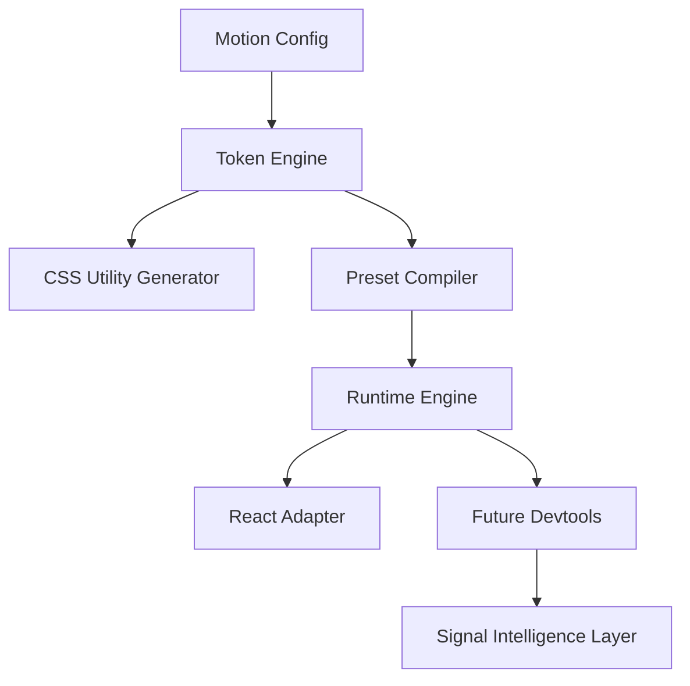

# Signal Motion Architecture

Signal Motion is a hybrid motion system designed for product teams.

It combines:

1. Utility-first motion classes (CSS layer)
2. A runtime animation engine (WAAPI-driven)
3. Thin framework adapters (React first)

This architecture enables:
- Predictable UX motion
- Design-token alignment
- Enter/exit state transitions
- Future integration with Signal intelligence

