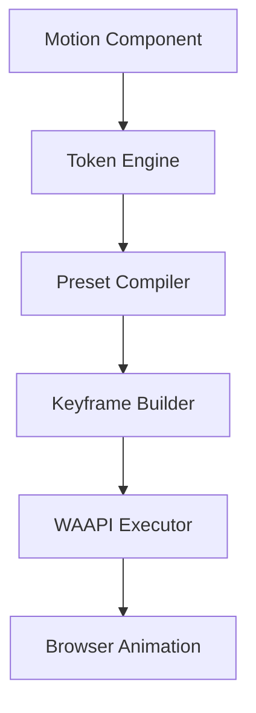

# Runtime Engine

The Signal Motion runtime is a WAAPI-first animation engine responsible for:

- Resolving motion tokens
- Compiling semantic presets
- Generating deterministic keyframes
- Executing animations
- Enforcing reduced-motion policies

The runtime layer powers state-based and lifecycle-driven motion.

---

# Design Goals

The runtime engine is built with the following principles:

1. WAAPI-first execution
2. Framework-agnostic core
3. Deterministic resolution
4. Accessibility enforcement
5. Minimal runtime overhead

The runtime is not responsible for styling or layout.  
It only resolves and executes motion.

---

# Why Web Animations API (WAAPI)?

Signal Motion uses the Web Animations API as its primary execution layer.

Benefits:

- Native browser performance
- Off-main-thread animation support
- Built-in cancellation control
- Fine-grained lifecycle management
- Smaller bundle size vs JS-driven animation loops

Example WAAPI call:

```ts
element.animate(keyframes, {
  duration: 200,
  easing: "cubic-bezier(0, 0, 0.2, 1)",
  fill: "both",
});
```

---

# Runtime Architecture



```text
┌─────────────────────────────────────┐
│         Signal Motion Runtime       │
│                                     │
│  • Token Resolver                   │
│  • Preset Compiler                  │
│  • Keyframe Generator               │
│  • WAAPI Executor                   │
│  • Reduced Motion Policy            │
└───────────────────────────┬─────────┘
                            │
                            ▼
┌─────────────────────────────────────┐
│         Web Animations API          │
│                                     │
│  • element.animate()                │
│  • Animation                        │
│  • Timeline control                 │
│  • Playback events                  │
└─────────────────────────────────────┘


```

---

# Token Resolution

When a preset is used, the runtime resolves tokens to concrete values:

```ts
// Input:
{
  preset: "slideUp",
  duration: "base",
  easing: "easeOut"
}

// Resolved:
{
  duration: 200,
  easing: "cubic-bezier(0, 0, 0.2, 1)",
  keyframes: [
    { opacity: 0, transform: "translateY(20px)" },
    { opacity: 1, transform: "translateY(0)" }
  ]
}
```

## Token names are fully resolved before execution.

# Keyframe Generation

The runtime generates WAAPI-compatible keyframes from semantic presets:

```ts
function generateKeyframes(preset: MotionPreset): Keyframe[] {
  const from = preset.from;
  const to = preset.to;

  return [
    {
      opacity: from.opacity ?? 1,
      transform: buildTransform(from),
    },
    {
      opacity: to.opacity ?? 1,
      transform: buildTransform(to),
    },
  ];
}
```

## Deterministic ordering prevents visual inconsistencies.

# Reduced Motion Handling

The runtime respects `prefers-reduced-motion`:

```ts
function resolveWithReducedMotion(config: ResolvedMotion): ResolvedMotion {
  if (!prefersReducedMotion) return config;

  switch (globalStrategy) {
    case "skip":
      return {
        duration: 0,
        easing: "linear",
        keyframes: [config.keyframes[1]],
      };

    case "shorten":
      return {
        ...config,
        duration: config.duration * shortenFactor,
      };

    case "replace":
      return replaceWithFade(config);
  }
}
```

## Accessibility is enforced at runtime — not optional.

# Animation Lifecycle

The runtime returns an animation handle:

```ts
interface AnimationHandle {
  play(): void;
  pause(): void;
  cancel(): void;
  reverse(): void;
  onComplete(callback: () => void): void;
  onCancel(callback: () => void): void;
}
```

---

# Presence & State Transitions

For enter/exit transitions:

- Enter animation runs on mount
- Exit animation runs before unmount
- DOM removal occurs after animation completion

## This enables smooth lifecycle motion.

# Cancellation Behavior

If a new animation starts before the previous one finishes:

- The previous animation is canceled
- The current computed style becomes the new start state
- The new animation executes

## This prevents animation stacking.

# Error Handling

The runtime validates:

- Token existence
- Preset completeness
- Duration validity
- Reduced-motion compliance

Invalid configurations throw deterministic errors:

```ts
throw new MotionError("INVALID_PRESET", "Preset 'slideUp' missing 'to' values");
```

---

# Performance Characteristics

Signal Motion runtime:

- Does not use JS animation loops
- Avoids layout thrashing
- Uses native browser scheduling
- Cancels animations on unmount
- Keeps memory footprint low

The runtime is optimized for:

- UI transitions
- Component-level motion
- Product state changes

It is not designed for:

- Physics simulations
- Complex timeline choreography
- Continuous animation loops

---

# Framework Integration

The runtime is framework-agnostic:

```ts
interface Runtime {
  animate(element: HTMLElement, config: ResolvedMotion): AnimationHandle;
}
```

Framework adapters (React, Vue, etc.) are thin wrappers around this API.

# React Adapter Example

```tsx
function useMotion(
  preset: string,
  options?: {
    duration?: string;
    easing?: string;
  },
) {
  const ref = useRef<HTMLElement | null>(null);

  useEffect(() => {
    if (!ref.current) return;

    // Resolve tokens before runtime
    const resolved = resolveMotion({
      preset,
      ...options,
    });

    const handle = runtime.animate(ref.current, resolved);

    return () => handle.cancel();
  }, [preset, options?.duration, options?.easing]);

  return ref;
}
```

---

# Architectural Rules

Adapters must:

- Handle lifecycle
- Pass resolved configuration to runtime
- Cancel animations on cleanup

Adapters must not:

- Generate keyframes
- Resolve tokens
- Implement easing logic
- Contain animation behavior

All motion logic belongs to the runtime layer.

# Performance Characteristics

- Minimal bundle size (runtime is ~2KB)
- No JS animation loops
- Leverages native browser optimizations
- Supports off-main-thread animation
- Low memory footprint

# Error Handling

The runtime validates:

- Token existence
- Preset completeness
- Reduced motion compliance
- Animation timing constraints

Invalid configurations throw deterministic errors:

```ts
throw new MotionError("INVALID_PRESET", "Preset 'slideUp' missing 'to' values");
```

Validation occurs before animation execution.

# Summary

The Signal Motion runtime is:

- WAAPI-first
- Framework-agnostic
- Deterministic
- Performance-optimized
- Accessibility-compliant

It is the engine that powers all state-based and lifecycle-driven motion in Signal Motion.
